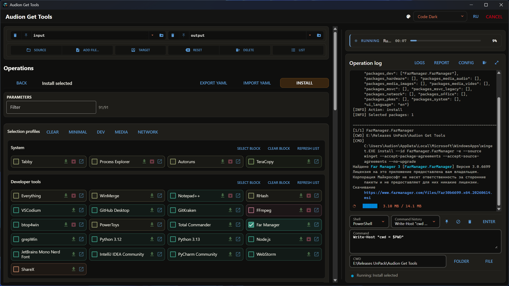

# Audion Get Tools

<!-- audion:release -->
<p align="center">
  <a href="https://audion.dev/downloads/get-tools"></a>
  <a href="https://github.com/Tensionix/get-tools/releases/latest"></a>
  <a href="https://github.com/Tensionix/get-tools/releases"></a>
  <a href="https://github.com/Tensionix/get-tools/blob/main/LICENSE"></a>
</p>

**Version 2.15.0** · 2026-09-04 · 208.4 MB

- [Direct download](https://audion.dev/get/get-tools/2.15.0/Audion_Get_Tools_v2.15.0_Full.zip) — unmetered, no rate limits
- [Project page](https://audion.dev/downloads/get-tools) — every version and how to install

<p align="center"></p>

`SHA-256: 49719adb1adaa8e7b5d80dcc52870adf6b1c9149de2fc46bd0ca06c77c387c07`

---

An **Audion** tool, published by [Tensionix](https://github.com/Tensionix).
<!-- /audion:release -->


[Русский](docs/README_RU.md) · [User Guide](docs/USER_GUIDE_EN.md)

**Contents**

- [Why It Exists](#why-it-exists)
- [What It Does](#what-it-does)
  - [WinGet sets: the catalog by groups](#winget-sets-the-catalog-by-groups)
  - [Install, update, pin, remove](#install-update-pin-remove)
  - [Download without installing: installer or portable, fresh from the authors](#download-without-installing-installer-or-portable-fresh-from-the-authors)
  - [Search and work by ID](#search-and-work-by-id)
  - [AI Package Planner](#ai-package-planner)
  - [Portable browsers](#portable-browsers)
  - [Vendor Downloads](#vendor-downloads)
  - [Visual C++ runtimes](#visual-c-runtimes)
  - [Import and export](#import-and-export)
  - [Service procedures](#service-procedures)
  - [The workbench](#the-workbench)
- [Principles](#principles)
- [Next](#next)
- [Technical Reference](#technical-reference)
  - [Running](#running)
  - [Sets](#sets)
  - [How the downloads section is built](#how-the-downloads-section-is-built)

Install, update, check, export and import sets of programs through the Windows
package manager. Next to it: installers straight from the vendors, Windows
images with the updates already inside, and package planning with an LLM.

## Why It Exists

A new machine means half a day of installing programs one by one. Reinstalling
the system means the same again, and half the programs are remembered only later,
when they turn out to be needed.

Windows can install packages by itself, from a command. But the list of what to
install still has to be kept in your head.

This program keeps it for you: package sets live as lists, and a machine is
brought up with one command. And whatever WinGet lacks, or hands out in the
wrong version, it takes from the vendor directly.

## What It Does

One window: the list of operations on the left, the log and a terminal on the
right. Every operation is a form of switches and cards with a single run button
at the bottom. Every caption and tooltip exists in English and Russian, the
language flips with a button in the header. One paragraph per ability below,
the details are behind the links into the user guide.

### WinGet sets: the catalog by groups

The catalog is 126 packages in twelve blocks: System, Developer tools, AI, PKMS
and notes, Office and documents, Media (images, audio, video), Browsers, VPN and
communication, Hardware and utilities, MSVC runtimes and the legacy MSVC
2005–2013. A block is a grid of cards with checkboxes; the list has a filter by
name and ID, `Select block` and `Clear block` buttons, and the profile row on
top (Minimal, Dev, Media, Network) ticks a typical set in one press, after which
any card can be changed. The ticks can be saved to YAML and loaded on another
machine.

Every block is a plain list of IDs in the configuration. Your own program is
added as a line, or with `Add ID to list` straight from the search window.

### Install, update, pin, remove

`Install selected` scans the system first, shows only what is missing and then
installs the ticked IDs without the Y/N prompts, with live progress in the log.
`Update selected`, `Update available` and `Update all available` work from the
`winget upgrade` list; `Preview updates` only shows it as "name, ID, current,
available". `Pin selected` keeps `config\pins.txt`: ticked packages get a
blocking pin and stop updating until you unpin them. `Remove selected IDs` shows
what is installed by the same blocks; system and runtime IDs are protected by an
extra checkbox. `Update WinGet` updates the manager itself.

### Download without installing: installer or portable, fresh from the authors

Every card carries three small buttons, and that is half the point of the
program. The green arrow downloads the installer into `output\Downloads`
without running it. The crimson box downloads the zip or standalone build into
`output\Portable`, the one that needs no installation; 29 programs of the
catalog have it, Notepad++, Everything, OBS Studio, VLC, Telegram, FFmpeg,
Node.js, MKVToolNix, Audacity, Sysinternals, Rufus, yt-dlp, SumatraPDF, Rclone
among them, and it shows only where such a build really exists. The blue arrow
opens the download page in the browser: the GitHub releases, the TechPowerUp
page or the vendor's site, to pick a build yourself — another architecture, an
older version.

The files come straight from the authors, not from someone's mirror: for
projects on GitHub the program reads the latest release and picks the right
file among the assets itself, x64 and portable first; for the rest, the vendor's
page. So the newest version lands in `output` even when the WinGet catalog lags:
Tabby and RClone Manager are taken from the releases page before they reach the
catalog, and the installer and the portable build are always the same version.
More: [user guide](docs/USER_GUIDE_EN.md#downloading-without-installing).

### Search and work by ID

For programs outside the catalog: `winget search` by name from the program's
window, install and remove by a typed ID, add a found ID into one of the catalog
blocks so that next time it is a card.

### AI Package Planner

Describe the task in words, "a video editor's workstation with Resolve and
FFmpeg", and an LLM (OpenAI or Gemini) proposes packages. Every candidate is
checked through `winget search`, only exact IDs make it into the plan, and only
those you tick get installed. Keys and models live on the `Models` tab,
instruction templates are pinned and reused. Installation goes the usual
protected way; the LLM runs nothing. More:
[user guide](docs/USER_GUIDE_EN.md#ai-package-planner).

### Portable browsers

Portable browser archives into `output\Portable` (Ungoogled Chromium, Zen, Cent
and others), the Google Chrome web installer without running it, a portable
7-Zip. Separately: building and updating Google Chrome Portable on the Chrome++
wrapper from the official standalone installer, with an architecture choice and
packing into ZIP or 7Z.

### Vendor Downloads

A second source next to WinGet: the vendors' own catalogs with every version
they ever published, not just the current one. Tabs at the top, platforms and
products below, then version cards with dates; each can be downloaded or just
linked. Downloads resume after a break, zips are unpacked, a lone root folder
in the archive is dropped.

- **Blackmagic Design**: DaVinci Resolve and Resolve Studio, Fusion, Blackmagic
  RAW, Desktop Video, Camera Setup and the rest of the catalog, 45 products.
  Studio comes without registration; the free Resolve only through the form,
  which is in the window.
- **Affinity**: the unified Affinity 3 (exe, msix, dmg) and Photo, Designer,
  Publisher 2.
- **NVIDIA**: Game Ready and Studio drivers by chip generation, `My cards` for
  one driver across every card in the house; each version carries its NVENC
  SDK, the compatible FFmpeg, the CUDA ceiling and ★ "golden" marks. Plus the
  NVIDIA App, Broadcast, CUDA Toolkit and the three DLSS libraries.
- **TechPowerUp**: the site's catalog with the whole version history of every
  entry, by section. Drivers: AMD Radeon and Ryzen chipset, Intel graphics,
  Wi-Fi, Bluetooth, Ethernet and NPU, Qualcomm Snapdragon X. Utilities: DDU,
  NVCleanstall, NVIDIA Profile Inspector, ThrottleStop, DRAM Calculator, Samsung
  Magician, Visual C++ Runtimes AIO, MemTest64. Monitoring: GPU-Z, CPU-Z,
  AIDA64, ZenTimings, Real Temp. Benchmarks: 3DMark, PCMark 10, Cinebench,
  FurMark, Prime95, Unigine, GravityMark, Linpack Xtreme, ATTO. Video BIOS:
  NVFlash, AMDVBFlash. The file comes from TechPowerUp's own signed link. A
  version is one card with two arrows, like the WinGet cards: the green one
  fetches the installer, the crimson archive icon fetches the portable build of
  the same version, which runs without installation; the Portable button turns
  the whole list to portable files. Some of these utilities are in the WinGet
  catalog too: there they install into the system, here any version comes as a
  file.
- **Windows through UUP dump**: any Windows 11 or 10 build from Microsoft's
  catalog with the cumulative update inside, the ISO built on the spot. Image
  kind Business, Consumer or Pro only; a Store app set (Minimal, Work,
  Everything) and the ballast group buttons; without the Edge browser, while
  the Edge WebView2 runtime is untouched and stays for apps; this machine's
  drivers embed into the image through `input`. The build runs in `UUP` at the root of the program's drive, the image
  lands in the destination folder.

More: [user guide](docs/USER_GUIDE_EN.md#vendor-downloads), the composition tables
below in the [technical reference](#windows-install-sets).

### Visual C++ runtimes

The MSVC 2015+ block in the catalog, the legacy 2005–2013 as a separate block,
and two All-in-One bundles (TechPowerUp and abbodi1406) that install every
runtime in one pass, including 2012, which WinGet does not have at all.
`Check MSVC runtimes` shows what is installed and what is available. The
project's classic CMD scripts are available as buttons. More:
[user guide](docs/USER_GUIDE_EN.md#visual-c-runtime-bundles-msvc).

### Import and export

`winget export` to JSON from a configured machine and `winget import` on a new
one, with the checkboxes "ignore versions", "do not upgrade installed" and
"ignore unavailable".

### Service procedures

Buttons without a form: the Windows licence state through slmgr, Health /
Doctor, the MSVC runtime check, checking that IDs exist in the source,
validating the configuration lists, clearing `input`/`output` and clearing the
logs.

### The workbench

At the top the `Source` and `Target` paths with history and pinning, buttons to
add files or a folder, a file list, reset and delete of the I/O contents. On the
right the operation log with the Logs, Report and Config buttons and a terminal:
PowerShell or cmd, command history, pinned commands, a working folder with
folder and file pickers. Dangerous operations ask for confirmation before they
run. Theme and language switch in the header. Every control and every tooltip
is described in the
[guide's reference](docs/USER_GUIDE_EN.md#reference-every-window-every-control-every-tooltip).

## Principles

**A set is a list of names.** An ordinary text file where a package is added as a
line. No proprietary format, no database of its own.

**Export and import.** The list is taken from a configured machine and applied to
a new one.

**Checking is separate from installing.** First you see what will be installed and
what is missing from the source — then it installs.

**Nothing happens silently.** Installing, removing and anything that changes the
system asks for confirmation; downloads and checks run at once.

**Two languages everywhere.** Every caption, tooltip and message has an English
and a Russian version.

## Next

* [User Guide](docs/USER_GUIDE_EN.md) — step by step, plus the reference of every control.

---

## Technical Reference

### Running

```cmd
Launcher-Audion-Get.cmd      command line
Launcher-Audion-Get-RU.cmd   the same in Russian
launcher_gui.cmd             windowed
```

### Sets

Package lists live in the configuration as separate files — one per machine
purpose. Windows, fields and tooltips are described in
`config\tool_manifest.yaml`; the control reference in the user guide is built
from it by `tools\docs\build_control_reference.py`.

### How the downloads section is built

A provider describes one catalog
(`system_core\vendors\`: Blackmagic Design, Affinity, NVIDIA and Windows through UUP dump; the NVIDIA
driver marks sit in `config\vendor_nvidia.yaml`), the shared
`vendor_service` fetches the chosen builds with resume into a folder per build
and unpacks zips, and the `Vendor Downloads` screen is one field group in
`tool_manifest.yaml`: vendor tabs plus fields shown by `visible_when`.
A new vendor is one provider file, its platform and product toggles in the
manifest, and a line in `vendor_service.VENDOR_FIELDS`.

#### Windows install sets

Install sets, the buttons of the `App set` row; each one just fills the card list, which can then be edited by hand or with the group buttons:

| Set | Packages | What gets installed | Who it is for |
|---|---|---|---|
| `Minimal` | 4 | system only: Store, Store purchases, Windows Security, App Installer | an image for an application server or a kiosk that needs nothing from the Store while WinGet and Store updates keep working |
| `Work` | 27 | the system packages, thirteen tools (Notepad, Windows Terminal, Calculator, Snipping Tool, Paint, Camera, Sound Recorder, Phone Link, Clock, Sticky Notes, To Do, Weather, Power Automate) and ten codecs | a work machine without entertainment and promotion; the default, and the reference image was built with it |
| `Everything` | 59 | the whole catalog as Microsoft ships it, only with the list open for editing | when everything stock is wanted with the option to untick a card or two |

The `Image kind` row above is about editions, not apps: `Business` is Pro plus Enterprise, Education, Pro Education and Pro for Workstations, `Consumer` is Home and Pro plus Education, Pro Education and Pro for Workstations, `Pro only` is one edition. Sets and image kinds combine freely.

#### Windows app groups

The whole Store package catalog the way the program divides it: the `Work` set plus the seven buttons of the `Include in the distribution build` row. 59 packages in total plus Edge, nothing sits outside a group.

| Group | Count | Inside | By default |
|---|---|---|---|
| System | 4 | Microsoft Store, Store purchases, Windows Security, App Installer (WinGet) | in the image, `Work` set |
| Tools | 13 | Notepad, Windows Terminal, Calculator, Snipping Tool, Paint, Camera, Sound Recorder, Phone Link, Clock, Sticky Notes, To Do, Weather, Power Automate | in the image, `Work` set |
| Codecs | 10 | Web Media, RAW images, HEIF, HEVC, VP9, WebP, AV1, MPEG-2, AVC encoder, Dolby Audio | in the image, `Work` set |
| Media stack | 4 | Media Player, Films & TV, Photos, Clipchamp | off |
| Edge | 1 | the Edge browser only; the Edge WebView2 runtime is untouched and stays, apps run and are built on it | off |
| Xbox | 6 | Xbox app, Xbox Game Bar, Xbox Game overlay, Xbox speech overlay, Xbox identity, Xbox TCUI | off |
| Teams and mail | 6 | Teams, Outlook (new), Mail and Calendar, People, Office hub (M365), Family | off |
| Bing and widgets | 6 | Bing Search, News, Widgets (web experience), Widgets runtime, Start experiences, Cortana | off |
| Promo and helpers | 8 | Solitaire, Tips, Get Help, Feedback Hub, Quick Assist, Dev Home, PC Manager, App compatibility enhancements | off |
| Small tools | 2 | Maps, Cross Device | off |

The `Minimal` set is the four system packages without the tools and the codecs, `Everything` turns every group on at once. OneDrive and Copilot are not in the catalog: they are not Store packages and are removed after installation.
